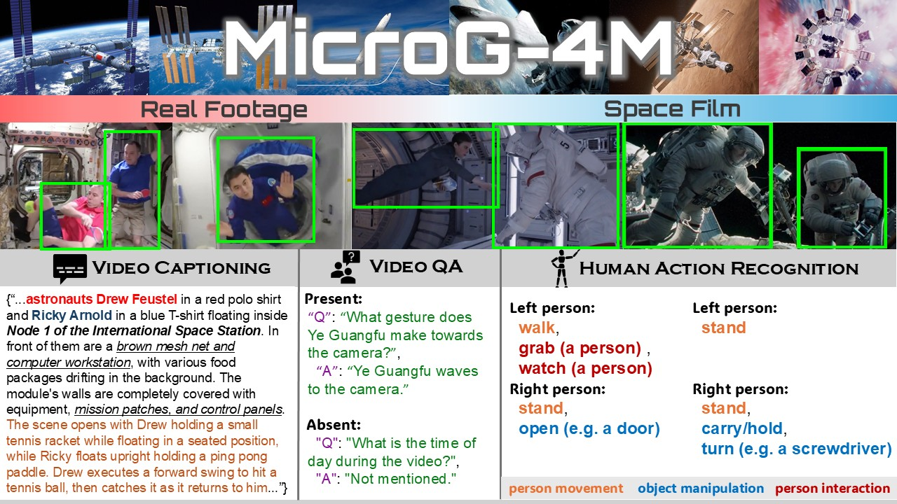

# [MicroG-4M](dataset): a benchmark dataset specific for HAR, VQA, and Captioning under microgravity



---

Despite substantial progress in terrestrial video understanding, most existing datasets remain limited to Earth’s gravity. Microgravity alters human motion, interactions, and Video semantics—walking resembles swimming, objects float unpredictably, and activities occur within confined spacecraft interiors—revealing a critical gap for domain-robust vision systems in safety-critical space applications.  

To address this, we introduce **MicroG-4M**, the first large-scale dataset and benchmark for spatio-temporal and semantic understanding of human activities in microgravity. MicroG-4M includes:
- **4 759** three-second video clips from real missions (ISS, Tiangong, EVA) and curated cinematic simulations
- **50** action categories capturing microgravity-specific motions and interactions
- **390 000+** annotations with bounding boxes
- **13 000+** multi-label action annotations
- **1 238** human-written, context-rich captions
- **7 000+** open-ended question–answer pairs supporting factual, causal, and counterfactual reasoning

MicroG-4M supports three core tasks:
1. **Fine-grained multi-label action recognition**  
2. **Video captioning**  
3. **Video question answering (VQA)**  

Baseline evaluations using state-of-the-art models (e.g., SlowFast, X3D, InternVideo, GPT-4o) demonstrate significant performance degradation under microgravity, underlining the necessity of dedicated benchmarks and domain-specific adaptation.

---

## Four Core Characteristics (“4M”)
- **Multi-domain**: videos from real missions (ISS, Tiangong, EVA) and cinematic simulations
- **Multimodal**: videos with bounding boxes, captions, and QA annotations
- **Multi-task**: supports action recognition, captioning, and VQA
- **Microgravity**: captures space-related motion and interactions  

> **Annotation Process:** Action annonations, Captions and QA pairs were created by human annotators and refined through multiple rounds of review to ensure high semantic fidelity, contextual accuracy, and relevance to microgravity settings.


## Dataset Files

The complete MicroG-4M dataset is hosted in our [Hugging Face repository](https://huggingface.co/datasets/LEI-QI-233/MicroG-4M), where you can view metadata and download the full dataset. For detailed information and specifications, please refer to this [README](https://huggingface.co/datasets/LEI-QI-233/MicroG-4M/blob/main/README.md) file.

## Related Code

All code related to the MicroG-4M dataset is available in this GitHub repository and are stored in [code](./code/) folder. Please refer to the [CODE.md](./code/CODE.md) file for details.

## Benchmarks

Please refer to the [BENCHMARK.md](./benchmark/BENCHMARK.md) for detailed information on benchmark statistics, evaluation metrics, baseline models, and fine-tuned weights.


## Statistics
All statistic data of dataset itself and of benchmark are in the [statistics](./statistics/) folder. Please refer to the [STATISTICS.md](./statistics/STATISTICS.md) file for details.

**Quick links to summarized info:**

- [Dataset Statictics](./statistics/dataset_statistics/HAR_Dataset_Statistics.pdf)
- [Benchmark Eval. and Statistics](./statistics/benchmark_statistics/HAR_finetune_eval.pdf)


## Contributors
HAR-in-Space is written and maintained by [Lei Qi](https://github.com/LEI-QI-233), [Di Wen](https://github.com/Kratos-Wen) and [Kunyu Peng](https://cvhci.iar.kit.edu/people_2123.php)

## Citing Zero-Gravity Human Action Recognition Dataset

If you find this dataset useful in your research, please use the following BibTeX entry for citation:

```BibTeX
@misc{harinspace2025,
  author =       {Lei Qi and Di Wen},
  title =        {MicroG-4M: a benchmark dataset specific for HAR, VQA, and Captioning under microgravity},
  howpublished = {\url{https://github.com/LEI-QI-233/HAR-in-Space}},
  year =         {2025}
}
```

## Reference
Our action-recognition baselines base on code from [PySlowFast](https://github.com/facebookresearch/SlowFast)

```BibTeX
@misc{fan2020pyslowfast,
  author =       {Haoqi Fan and Yanghao Li and Bo Xiong and Wan-Yen Lo and
                  Christoph Feichtenhofer},
  title =        {PySlowFast},
  howpublished = {\url{https://github.com/facebookresearch/slowfast}},
  year =         {2020}
}
```